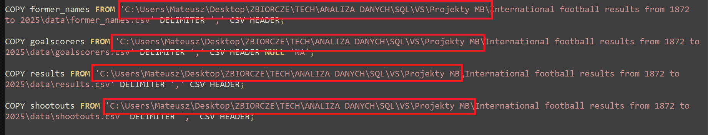

# 📊 SQL Analysis of International Football Results 

## 📚 Table of Contents
- **Project Overview**
- **Data Overview**
- **Structure Explanation**
- **How to Run**
- **Sample Queries**
- **Technical Details**
- **Author**

## 🔎 Project Overview

    The goal of this project is to analyze international football data from 1872 to 2025 using PostgreSQL. Analysis itself is divided into three separate SQL files (plus an additional one that establishes the database), followed later by Excel files that contain charts which visually represent SQL outputs. The project takes a closer look at players stats, country comparisons and other.

## 📂 Data Overview

The dataset consists of **four CSV files**:

- `goalscorers.csv` – contains match date, player name, team, minute of the goal etc.  
- `results.csv` – contains match date, teams, score, host country etc.  
- `shootouts.csv` – contains penalty shootout data (not used in this project).  
- `former_names.csv` – contains former and current country names mappings (not used in this project).  

**Data source:** [Kaggle International Football Results Dataset](https://www.kaggle.com/datasets/martj42/international-football-results-from-1872-to-2017) 

## 🧱 Structure Explanation

| Folder / File | Description |
|----------------|-------------|
| **data/** | Contains original data files |
| **sql queries/** | SQL scripts used for analysis |
| **visualization/** | Excel charts used to visualize analysis |
| **README.md** | Project overview 

---

## ⚙️ How to Run

1. Install PostgreSQL locally 
2. Download the entire folder
3. Run SQL scripts starting with file ***0. create.sql***
4. Update all directory paths (red rectangles in the screen below) in [0. create.sql](sql%20queries/0.%20create.sql) file

## 📈 Sample Queries

### The best scorers every decade

Query: [1.3 Top scorers in every decade](sql%20queries/1.%20individual%20stats%20analysis.sql)

**Visualization:**

**Insights:**

    It appears that players tend to score more and more goals with each passing decade. The best national scorer is Ronaldo (2010s). The best scorer in current decade is Harry Kane, who has scored almost half as many goals as Ronaldo. However, the decade isn't over yet!

### Argentina vs Brazil

Query: [2.4 Comparison between Brazil and Argentina (results and goals)](sql%20queries/2.%20team%20stats%20analysis.sql)

**Visualization:**

**Insights:**

    The query compares direct results for Argentina and Brazil - one of the most famous and oldest national rivalries. According to results, Brazil has won 2 more games against Argentina and scored two goals more. This emphasizes how close and competitive the rivalry has been.

### Most Popular Third-Country Match Locations

Query: [3.1 The most popular places where home or away country didn't participate in the game](sql%20queries/3.%20most%20popular.sql)

**Visualization:**

**Insights:**

    The query shows what are the most famous third-countries match locations (host countries that didn't participate in the game). The most popular country is the USA with 997 games, then Malaysia with 508 games and France with 442 games. Other popular places are: Latin America, Middle East, West Africa. It is worth to notice that Western Europe is way behind those locations. 

## 🖥️ Technical Details

- **Database:** PostgreSQL
- **Environment:** Visual Studio Code
- **Visualization:** Excel Charts
- **Data source:** [Kaggle International Football Results Dataset](https://www.kaggle.com/datasets/martj42/international-football-results-from-1872-to-2017) 

## ✒️ Author

- **Author:** Mateusz Bochenek
- **Mail:** matbochenek42@gmail.com
- **GitHub link:** https://github.com/matbochenek42
- **LeetCode link:** https://leetcode.com/u/SmO7BWmsiz/
